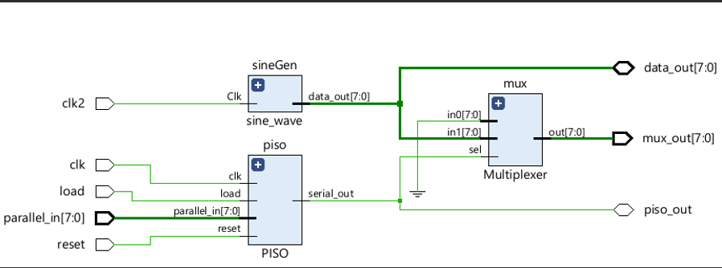
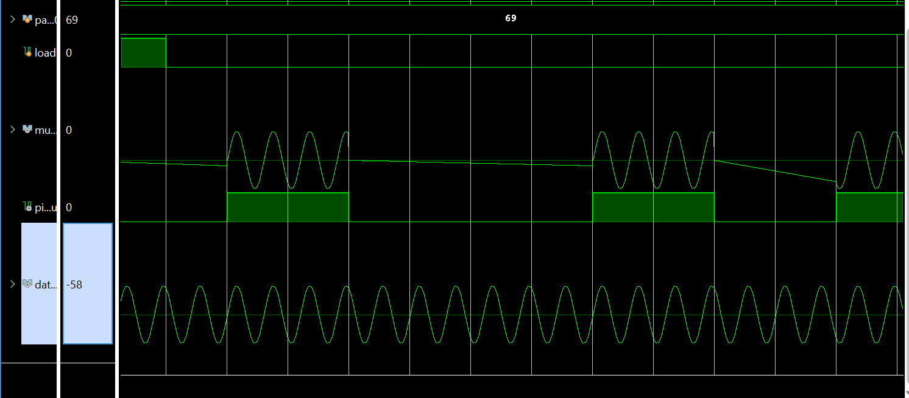
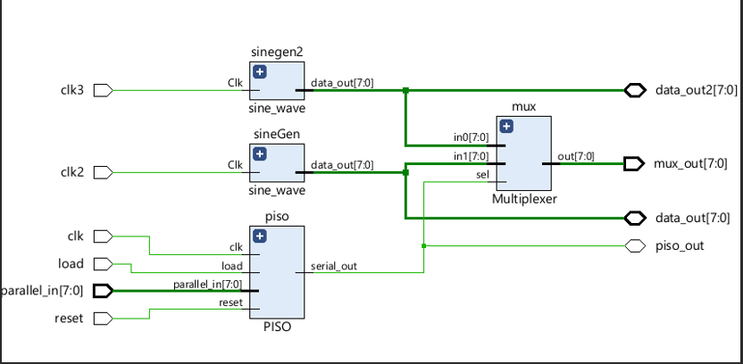
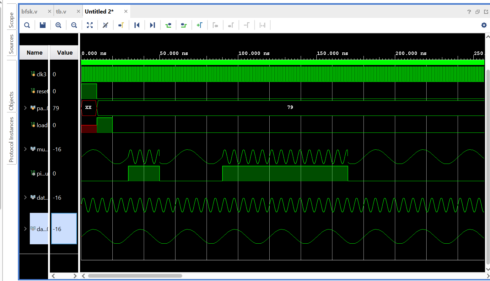
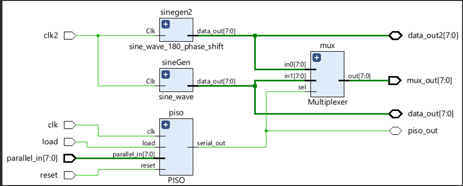
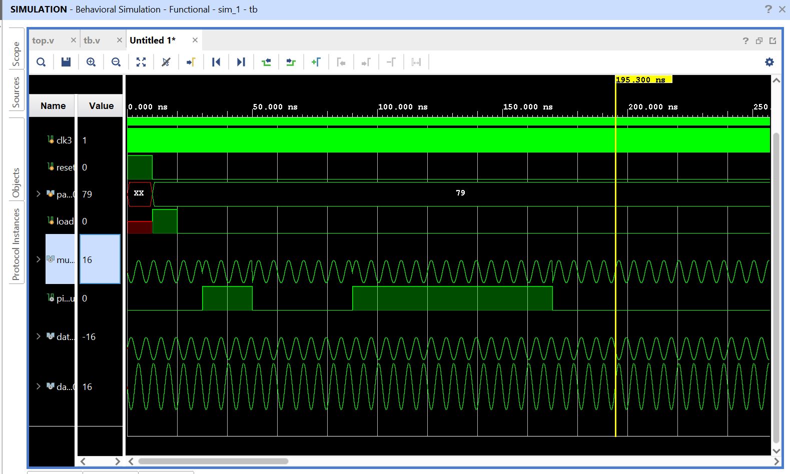

# Efficient Implementation of Digital Modulation Techniques on FPGA Using Verilog

This project demonstrates the implementation of digital modulation techniques using Verilog on FPGA. The techniques implemented are BASK, BFSK, and BPSK, each showcasing resource efficiency and practical usability in communication systems.

---

## Table of Contents
1. [Introduction](#introduction)
2. [Binary Amplitude Shift Keying (BASK)](#binary-amplitude-shift-keying-bask)
3. [Binary Frequency Shift Keying (BFSK)](#binary-frequency-shift-keying-bfsk)
4. [Binary Phase Shift Keying (BPSK)](#binary-phase-shift-keying-bpsk)
5. [Conclusion](#conclusion)

---

## Introduction

Digital modulation is essential for communication systems, enabling efficient transmission of information. This project focuses on implementing three primary digital modulation schemes on FPGA:
- Binary Amplitude Shift Keying (BASK)
- Binary Frequency Shift Keying (BFSK)
- Binary Phase Shift Keying (BPSK)

The implementation leverages Verilog HDL and FPGA tools like Vivado to achieve optimal performance and resource utilization.

---

## Binary Amplitude Shift Keying (BASK)

### Code
[View BASK Code](./bask.v)

### Testbench
[View BASK Testbench](./bask_tb.v)

### RTL Schematic

### Output Waveform

---

## Binary Frequency Shift Keying (BFSK)

### Code
[View BFSK Code](./bfsk.v)

### Testbench
[View BFSK Testbench](./bfsk_tb.v)

### RTL Schematic

### Output Waveform

---

## Binary Phase Shift Keying (BPSK)

### Code
[View BPSK Code](./bpsk.v)

### Testbench
[View BPSK Testbench](./bpsk_tb.v)

### RTL Schematic

### Output Waveform

---

## Conclusion

The project demonstrates efficient implementation of digital modulation techniques using Verilog on FPGA. Key achievements include:
- Resource optimization for LUTs and FFs.
- Scalability for higher-order modulation schemes.
- Real-time performance suitable for communication systems.

This implementation provides a foundation for future enhancements, including:
- Support for higher-order modulation schemes.
- Enhanced scalability for integration with complex systems.

